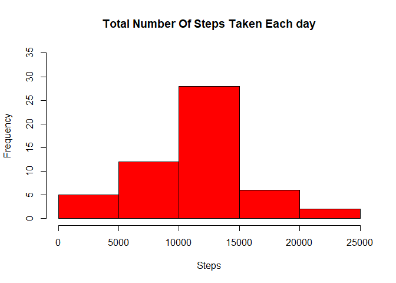
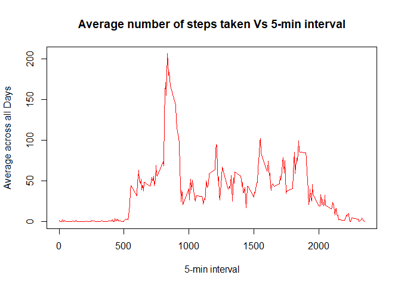
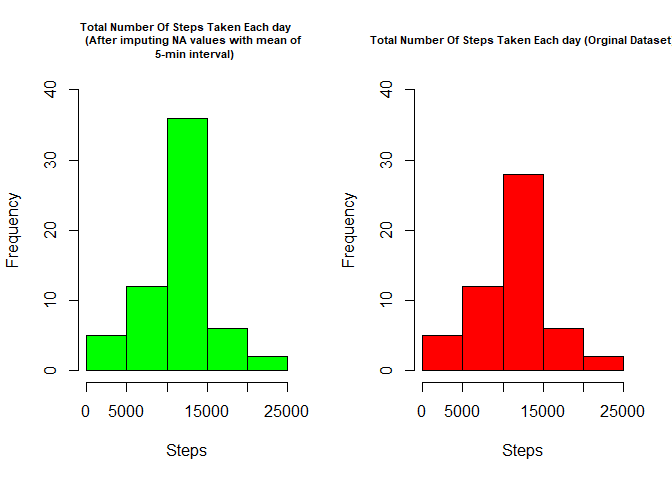

# Reproducible research - Peer Assignment 1

by Martina ulivieri

12.07.2020

## Loading and processing the data

Unzip data 


```r
library('data.table')
library(ggplot2)
unzip('activity.zip')
```

Reading csv data

```r
activity <-  read.csv("activity.csv", header = TRUE)
```

Process/transform the data (if necessary) into a format suitable for your analysis

```r
head(activity)
```

```
##   steps       date interval
## 1    NA 2012-10-01        0
## 2    NA 2012-10-01        5
## 3    NA 2012-10-01       10
## 4    NA 2012-10-01       15
## 5    NA 2012-10-01       20
## 6    NA 2012-10-01       25
```

```r
names(activity)
```

```
## [1] "steps"    "date"     "interval"
```

```r
library(lattice)
activity$date <- as.Date(activity$date, "%Y-%m-%d")
```

## What is the mean total number of steps taken per day?

For this part of the assignment, missing values will be ignored!

1. Calculate the total number of steps taken per day


```r
StepsTotal <- aggregate(steps ~ date, data = activity, sum, na.rm = TRUE)
head(StepsTotal)
```

```
##         date steps
## 1 2012-10-02   126
## 2 2012-10-03 11352
## 3 2012-10-04 12116
## 4 2012-10-05 13294
## 5 2012-10-06 15420
## 6 2012-10-07 11015
```

2. If you do not understand the difference between a histogram and a barplot, research the difference between them. Make a histogram of the total number of steps taken each day. 


```r
hist(StepsTotal$steps, main = "Total Number Of Steps Taken Each day", 
     xlab = "Steps", 
     ylab = 'Frequency',
     ylim = c(0, 35),
     col = "red")
```

<!-- -->

3. Calculate and report the mean and median of the total number of steps taken per day


```r
rmean <- mean(StepsTotal$steps, na.rm = TRUE)
rmedian <- median(StepsTotal$steps, na.rm = TRUE)
sprintf("MEAN of steps taken each day = %.3f", rmean)
```

```
## [1] "MEAN of steps taken each day = 10766.189"
```

```r
sprintf('MEDIAN of steps taken each day = %. 3f', rmedian)
```

```
## [1] "MEDIAN of steps taken each day = 10765.000"
```
## What is the average daily activity pattern?

1. Make a time series plot (i.e. type='1') of the 5-minute interval (x-axis) and the average number of steps taken, averaged across all days (y-axis)


```r
time_series <- tapply(activity$steps, activity$interval, mean, na.rm = TRUE)
plot(row.names(time_series), time_series, 
     type = "l", 
     xlab = "5-min interval", 
     ylab = "Average across all Days", 
     main = "Average number of steps taken Vs 5-min interval", 
     col = "red")
```

<!-- -->

2. Which 5-minute interval, on average across all the days in the dataset, contains the maximum number of steps?


```r
max_interval <- which.max(time_series)
x <- names(max_interval)
sprintf("The 5-minutes interval with maximum number of steps is = %s", x)
```

```
## [1] "The 5-minutes interval with maximum number of steps is = 835"
```

## Imputing missing values 

1. Calculate and report the total number of missing values in the dataset (i.e. the total number of rows with NAs)


```r
activity_NA <- sum(is.na(activity))
sprintf('The total number of missing values is = %1.0f', activity_NA)
```

```
## [1] "The total number of missing values is = 2304"
```

2. Devise a strategy for filling in all of the missing values in the dataset. The strategy does not need to be sophisticated. For example, you could use the mean/median for that day, or the mean for that 5-minute interval, etc.


```r
StepsAverage <- aggregate(steps ~ interval, data = activity, FUN = mean)
fillNA <- numeric()
for (i in 1:nrow(activity)) {
    obs <- activity[i, ]
    if (is.na(obs$steps)) {
        steps <- subset(StepsAverage, interval == obs$interval)$steps
    } else {
        steps <- obs$steps
    }
    fillNA <- c(fillNA, steps)
}
```

3. Create a new dataset that is equal to the original dataset but with the missing data filled in.


```r
new_activity <- activity
new_activity$steps <- fillNA
```

4. Make a histogram of the total number of steps taken each day and calculate and report the mean and median total number of steps taken per day. Do these values differ from the estimates from the first part of the assignment? What is the impact of imputing missing data on the estimates of the total daily number of steps?


```r
StepsTotal2 <- aggregate(steps ~ date, data = new_activity, sum, na.rm = TRUE)
par(mfrow=c(1,2))
hist(StepsTotal2$steps, 
     xlab = "Steps", 
     ylab = 'Frequency', 
     col = "green", 
     ylim = c(0,40), 
     main = "Total Number Of Steps Taken Each day 
     (After imputing NA values with mean of 
     5-min interval)", 
     cex.main = 0.7)
hist(StepsTotal$steps, 
     xlab = "Steps", 
     ylab = 'Frequency', 
     col = "red",
     ylim = c(0, 40),
     main = 'Total Number Of Steps Taken Each day (Orginal Dataset)',
     cex.main = 0.7)
```

<!-- -->

```r
par(mfrow=c(1,1))
new_mean <- mean(StepsTotal2$steps)
new_median <- median(StepsTotal2$steps)
sprintf('The new mean is = %. 3f', new_mean)
```

```
## [1] "The new mean is = 10766.189"
```

```r
sprintf('The original mean is =%. 3f', rmean)
```

```
## [1] "The original mean is =10766.189"
```

```r
sprintf('The new median is = %. 3f', new_median)
```

```
## [1] "The new median is = 10766.189"
```

```r
sprintf('The original median is = %. 3f', rmedian)
```

```
## [1] "The original median is = 10765.000"
```
There is no difference between the original and the new mean while the median changes a bit.

## Are there differences in activity patterns between weekdays and weekends?

For this part the weekdays() function may be of some help here. Use the dataset with the filled-in missing values for this part.

1. Create a new factor variable in the dataset with two levels – “weekday” and “weekend” indicating whether a given date is a weekday or weekend day.


```r
day <- weekdays(activity$date)
daylevel <- vector()
for (i in 1:nrow(activity)) {
    if (day[i] == "Saturday") {
        daylevel[i] <- "Weekend"
    } else if (day[i] == "Sunday") {
        daylevel[i] <- "Weekend"
    } else {
        daylevel[i] <- "Weekday"
    }
}
activity$daylevel <- daylevel
activity$daylevel <- factor(activity$daylevel)

stepsByDay <- aggregate(steps ~ interval + daylevel, data = activity, mean)
names(stepsByDay) <- c("interval", "daylevel", "steps")
```

2. Make a panel plot containing a time series plot (i.e. type = 'l') of the 5-minute interval (x-axis) and the average number of steps taken, averaged across all weekday days or weekend days (y-axis). See the README file in the GitHub repository to see an example of what this plot should look like using simulated data.


```r
xyplot(steps ~ interval | daylevel, stepsByDay, type = "l", layout = c(1, 2), 
    xlab = "Interval", ylab = "Number of steps")
```

<!-- -->

